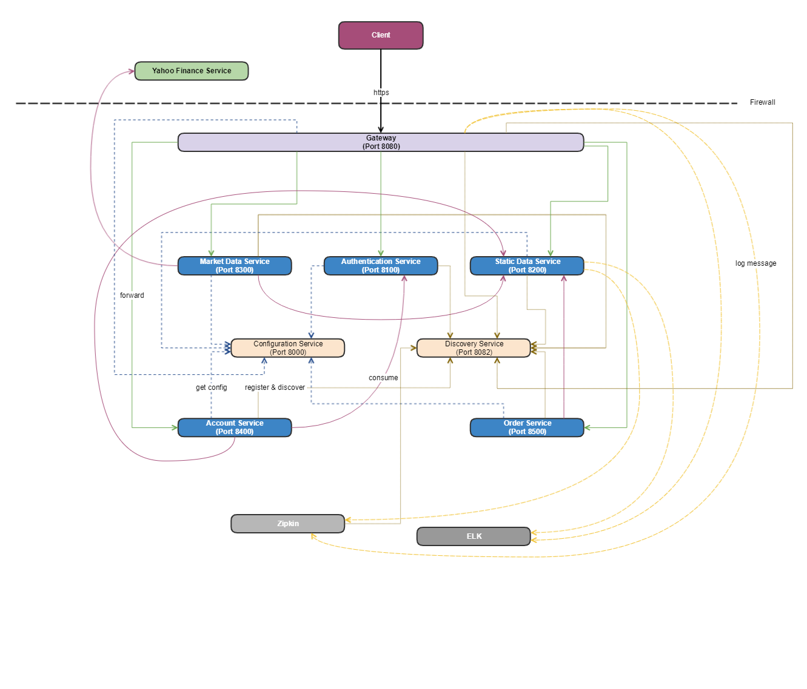

# itsmicrosrv

This project demostrates a cloud native microservices application.  It is a spring boot application written in Kotlin, with the following features demostrated :
 
  - Spring Web Reactive
  - Spring Cloud Config
  - Spring Cloud Discovery
  - Spring Cloud Zuul
  - Spring Cloud Sleuth
  - Spring Rest Docs and Spring Rest AutoDocs (https://scacap.github.io/spring-auto-restdocs/)

---
  
## Application Architecture

